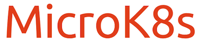

MicroK8s est un outil axé sur la simplicité et l'expérience développeur. Il est notamment très adapté pour l'IoT, l'Edge computing, ... C'est une distribution légère, qui fournit de nombreux add-ons, composants pré-packagés donnant à Kubernetes des capacités supplémentaires: de la simple gestion DNS à l'apprentissage automatique avec Kubeflow.


Sur Windows, MacOS ou Linux, MicroK8s peut facilement être installé dans une machine virtuelle. Nous utiliserons [Multipass](https://multipass.run) un outils très pratique qui permet de lancer facilement des machines virtuelles Ubuntu sur Mac, Linux, ou Windows.

Note: l'installation de Multipass et l'illustration des différentes commandes ont été détaillées dans un exercice précédent, n'hésitez pas à vous y reporter.

### 1. Création d'une VM Ubuntu

Utilisez la commande suivante pour créer une VM Ubuntu 18.04 avec Multipass, cela ne prendra que quelques dizaines de secondes:

```
multipass launch --name microk8s --memory 4G
```

### 2. Installation de microk8s dans la VM

Utilisez la commande suivante pour lancer l'installation de microk8s dans la VM que vous venez de provisionner:

```
multipass exec microk8s -- sudo snap install microk8s --classic
```

Note: nous utilisons ici la commande `multipass exec` permettant de lancer une commande directement dans une VM donnée. Nous aurions également pu lancer un shell dans la VM *microk8s* et lancer la commande `sudo snap install microk8s --classic` depuis ce shell.

### 3. Fichier de configuration

Récupérez, sur votre machine locale, le fichier de configuration généré par microk8s:

```
multipass exec microk8s -- sudo microk8s.config > microk8s.yaml
```

Utilisez ensuite la commande suivante afin de positionner la variable d'environnement KUBECONFIG de façon à ce qu'elle pointe vers le fichier de configuration récupéré précédemment (cela permettra de configurer le client *kubectl* de votre machine locale):

```
export KUBECONFIG=$PWD/microk8s.yaml
```

### 4. Accès au cluster

Nous pouvons maintenant accéder au cluster et lister les nodes:

```
kubectl get nodes
```

### 5. Add-ons

Microk8s est livré avec de multiples addons dont la liste peut être obtenue avec la commande suivante (commande à lancer depuis un shell)

```
multipass exec microk8s -- sudo microk8s status
```

Vous devriez obtenir un résultat similaire à celui ci-dessous:

```
microk8s is running
high-availability: no
  datastore master nodes: 127.0.0.1:19001
  datastore standby nodes: none
addons:
  enabled:
    dns                  # (core) CoreDNS
    ha-cluster           # (core) Configure high availability on the current node
    helm                 # (core) Helm - the package manager for Kubernetes
    helm3                # (core) Helm 3 - the package manager for Kubernetes
  disabled:
    cert-manager         # (core) Cloud native certificate management
    community            # (core) The community addons repository
    dashboard            # (core) The Kubernetes dashboard
    host-access          # (core) Allow Pods connecting to Host services smoothly
    hostpath-storage     # (core) Storage class; allocates storage from host directory
    ingress              # (core) Ingress controller for external access
    kube-ovn             # (core) An advanced network fabric for Kubernetes
    mayastor             # (core) OpenEBS MayaStor
    metallb              # (core) Loadbalancer for your Kubernetes cluster
    metrics-server       # (core) K8s Metrics Server for API access to service metrics
    minio                # (core) MinIO object storage
    observability        # (core) A lightweight observability stack for logs, traces and metrics
    prometheus           # (core) Prometheus operator for monitoring and logging
    rbac                 # (core) Role-Based Access Control for authorisation
    registry             # (core) Private image registry exposed on localhost:32000
    storage              # (core) Alias to hostpath-storage add-on, deprecated
```

Note: pour activer un addon, il suffit d'utiliser la commande `multipass exec microk8s -- sudo microk8s enable ADDON_NAME`

Microk8s est une solution très adaptée pour mettre en place une installation locale de Kubernetes. C'est également une distribution qui peut etre configurée avec plusieurs nodes et utilisée dans un environnement de production.

