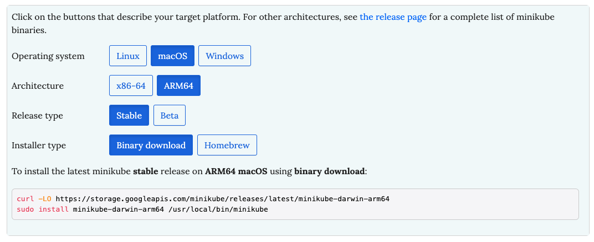

Minikube est une solution permettant de faire tourner un cluster Kubernetes en local, soit dans des machines virtuelles, soit dans des containers Docker.

## 1. Récupération du binaire

Depuis le lien suivant https://minikube.sigs.k8s.io/docs/start/ renseigner les caractéristique de votre environnement local et télécharger le binaire correspondant en utilisant les commandes fournies.

L'exemple ci-dessous montre les commandes nécessaires pour récupérer minikube pour un environnement MacOS / AppleSilicon.



## 2. Lancement

:fire: de nombreuses options de lancement sont disponible, vous pouvez lister celles-ci avec la commande ```minikube start --help```

### Exemple 1: cluster avec un seul node

La commande suivante permet de lancer Minikube:

```
minikube start
```

Votre client *kubectl* (dont l'installation a été effectuée dans un exercice précédent) a automatiquement été configuré pour communiquer avec le cluster ainsi crée. Vous pouvez lister l'unique node avec la commande suivante:

```
kubectl get node
```

### Exemple 2: cluster avec 3 nodes

La commande suivante permet de lancer un cluster de 3 nodes:

```
minikube start --nodes 3
```

Comme précédemement, les nodes peuvent être listés avec la commande suivante:

```
kubectl get no
```

## 4. Suppression

Afin de détruire un cluster mis en place avec Minikube, il suffit de lancer la commande suivante:

```
minikube delete
```