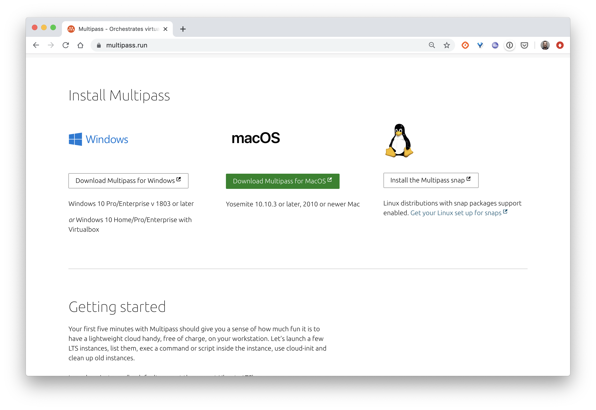

Multipass est un utilitaire développé par Canonical, il permet de lancer des machines virtuelles Ubuntu facilement.

En fonction de l'OS, Multipass peut utiliser différents hyperviseurs:
- Hyper-V
- HyperKit
- KVM
- VirtualBox

En s'intégrant de manière native à ces hyperviseurs, il permet de démarrer des machines virtuelles très rapidement.

## Installation

Vous trouverez sur le site [https://multipass.run](https://multipass.run) la procédure d'installation de Multipass en fonction de votre OS.



## Commandes disponibles

La liste des commandes disponibles pour la gestion du cycle de vie des VMs peut être obtenue avec la commande suivante:

```
$ multipass
Usage: multipass [options] <command>
Create, control and connect to Ubuntu instances.

This is a command line utility for multipass, a
service that manages Ubuntu instances.

Options:
  -h, --help     Displays help on commandline options
  -v, --verbose  Increase logging verbosity. Repeat the 'v' in the short option
                 for more detail. Maximum verbosity is obtained with 4 (or more)
                 v's, i.e. -vvvv.

Available commands:
  alias         Create an alias
  aliases       List available aliases
  authenticate  Authenticate client
  delete        Delete instances
  exec          Run a command on an instance
  find          Display available images to create instances from
  get           Get a configuration setting
  help          Display help about a command
  info          Display information about instances
  launch        Create and start an Ubuntu instance
  list          List all available instances
  mount         Mount a local directory in the instance
  networks      List available network interfaces
  purge         Purge all deleted instances permanently
  recover       Recover deleted instances
  restart       Restart instances
  set           Set a configuration setting
  shell         Open a shell on a running instance
  start         Start instances
  stop          Stop running instances
  suspend       Suspend running instances
  transfer      Transfer files between the host and instances
  umount        Unmount a directory from an instance
  unalias       Remove aliases
  version       Show version details
```

Nous allons voir quelques unes de ces commandes sur des exemples.

## Quelques exemples

La manipulation de VMs se fait très facilement:

- création d'une nouvelle VM nommée *node1* (en quelques dizaines de secondes seulement)

```
multipass launch -n node1
```

Par défaut cette VM est configurée avec 1G de RAM, 1 cpu et 5 Go de disque mais différentes options peuvent être utilisées pour modifier ces valeurs. La commande suivante permet par exemple de créer une VM nommée *node2* avec 2 cpu, 3 Go de RAM et 10 Go de disque:

```
multipass launch -n node2 -c 2 -m 3G -d 10G
```

- information sur une VM

La commande suivante retourne les différents paramètres de configuration de la VM

```
multipass info node1
```

Il est également possible d'obtenir ces informations dans les formats json, csv ou yaml. Exemple en json:

```
multipass info node1 --format json
```

- liste des VM créés

```
multipass list
```

Cette commande devrait renvoyer les informations similaires à celles ci-dessous:

```
Name                    State             IPv4             Image
node1                   Running           192.168.205.2    Ubuntu 22.04 LTS
node2                   Running           192.168.205.3    Ubuntu 22.04 LTS
```

- Lancement d'un shell dans la VM *node1*

```
multipass shell node1
```

On obtient alors un shell avec l'utilisateur *ubuntu* qui est notamment dans le groupe *sudo*.

- lancement d'une commande dans une VM

La commande suivante permet d'installer Docker dans la VM *node1*

```
multipass exec node1 -- /bin/bash -c "curl -sSL https://get.docker.com | sh"
```

On peut alors vérifier que l'installation s'est déroulée correctement:

```
multipass exec node1 -- sudo docker version
```

- montage d'un répertoire local dans une VM

```
# Création d'un fichier en local
mkdir $HOME/test && touch $HOME/test/hello

# Montage du répertoire dans le filesystem de la VM node1
multipass mount $HOME/test node1:/usr/share/test

# Vérification
multipass exec node1 -- ls /usr/share/test
```

La commande *umount* permet de faire l'opération inverse et de supprimer ce point de montage:

```
multipass umount node1:/usr/share/test
```

- copie de fichiers entre la machine local et les VMs

Il est possible de transférer des fichiers locaux vers une VM et inversement, sans avoir à monter un répertoire (cf exemple précédent)

```
# Copie d'un fichier depuis la machine locale
multipass transfer $HOME/test/hello node1:/tmp/hello

# Vérification
multipass exec node1 -- ls /tmp/hello
```

- les commandes start / stop / restart / delete permettent de gérer le cycle de vie des VMs

```
multipass delete -p node1 node2
```

## En résumé

Comme nous venons de le voir dans les exemples ci-dessus, Multipass est un utilitaire très pratique et extrêmement simple d'utilisation. Je vous conseille de l'installer car vous pourrez l'utiliser dans la suite pour instancier plusieurs VMs et mettre en place un cluster Kubernetes en local.
